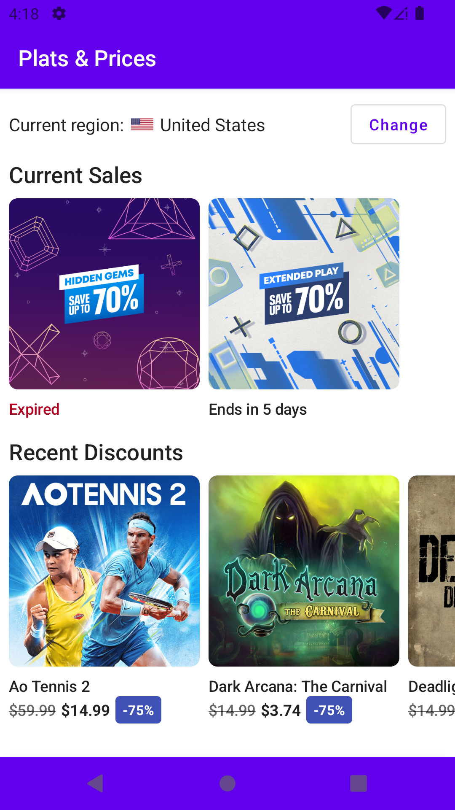

# Plats and Prices

An Android PS sales viewer created using Jetpack Compose. Sales data is provided by [platprices.com](https://platprices.com).

<p></p>

## Note

API key from [platprices.com](https://platprices.com) is required to compile this project. You may request one by following steps
listed [here](https://platprices.com/developers.php).

## Setup

Once you have obtained the API key. Create a file named `api.properties` in the root folder and add the following property:

```properties
PLAT_PRICES_API_KEY=API_KEY
```

Replace `API_KEY` with the actual API key.

## Screenshots

### Light

<a href="https://github.com/ammargitham/plats-and-prices/blob/main/.github/screenshots/light/loading.png" title="Loading"></a>
<a href="https://github.com/ammargitham/plats-and-prices/blob/main/.github/screenshots/light/home.png" title="Home"></a>
<a href="https://github.com/ammargitham/plats-and-prices/blob/main/.github/screenshots/light/region_picker.png" title="Region Picker"></a>
<a href="https://github.com/ammargitham/plats-and-prices/blob/main/.github/screenshots/light/list.png" title="Discount List"></a>
<a href="https://github.com/ammargitham/plats-and-prices/blob/main/.github/screenshots/light/grid.png" title="Discount Grid"></a>
<a href="https://github.com/ammargitham/plats-and-prices/blob/main/.github/screenshots/light/sort.png" title="Discount Sort Options"></a>
<a href="https://github.com/ammargitham/plats-and-prices/blob/main/.github/screenshots/light/filter.png" title="Discount Filter Options"></a>
<a href="https://github.com/ammargitham/plats-and-prices/blob/main/.github/screenshots/light/detail_1.png" title="Discount Details"></a>
<a href="https://github.com/ammargitham/plats-and-prices/blob/main/.github/screenshots/light/detail_2.png" title="Discount Details"></a>

### Dark

<a href="https://github.com/ammargitham/plats-and-prices/blob/main/.github/screenshots/dark/home.png" title="Home"></a>
<a href="https://github.com/ammargitham/plats-and-prices/blob/main/.github/screenshots/dark/grid.png" title="Discount Grid"></a>
<a href="https://github.com/ammargitham/plats-and-prices/blob/main/.github/screenshots/dark/detail_1.png" title="Discount Details"></a>
<a href="https://github.com/ammargitham/plats-and-prices/blob/main/.github/screenshots/dark/detail_2.png" title="Discount Details"></a>

## Contributing

See the [contributing](https://github.com/ammargitham/plats-and-prices/blob/master/.github/CONTRIBUTING.md) documentation for information on how to
contribute.

## License

    Plats & Prices
    Copyright (C) 2021  Ammar Githam <ammar.githam@outlook.com>

    This program is free software: you can redistribute it and/or modify
    it under the terms of the GNU General Public License as published by
    the Free Software Foundation, either version 3 of the License, or
    (at your option) any later version.

    This program is distributed in the hope that it will be useful,
    but WITHOUT ANY WARRANTY; without even the implied warranty of
    MERCHANTABILITY or FITNESS FOR A PARTICULAR PURPOSE.  See the
    GNU General Public License for more details.

    You should have received a copy of the GNU General Public License
    along with this program. If not, see <https://www.gnu.org/licenses/>.